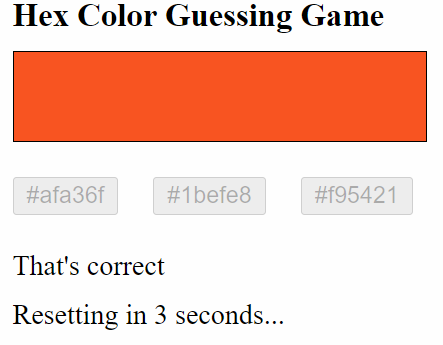
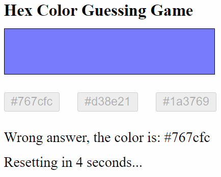

# CS569-Hex Color Guessing Game
Welcome to the first workshop in the CS569 course. We are going to build a HEX color guessing game!  
  
This is a competitive workshop, the first 3 students who submit a correct solution before 12:30 PM (including the extra requirements) will have one extra day to work and submit their final project! We will meet at 2:00 PM and I will code the solution with you. Good luck to everyone, and happy coding!  
  
If you pushed your code before 12:30 PM, send me a text message on Teams so I could check your code immediately and determine your eligibility for the final project advantage.  
## Game specifications
In this game users will have to guess the displayed color from 3 buttons as shown below:
<p align="center">
  
</p>
  
Once the user clicks on the answer:  
* All buttons are disabled.  
* A message is displayed with: "That's Correct!" Or "Wrong answer, the color is: #RRGGBB".  
* Display an interval countdown from 5 to 0 seconds and reset the game once it reaches 0 (Reset: pick a new color, activate buttons, remove all messages) as displayed below:  
  
<p align="center">
  
  
</p>
  
## Extra requirements
1. Create a directive `CheatDirective`, that listens to its host element (color div) for double-click event, and displays the HEX color value as alert.
2. Persist the scoreboard state in the `localStorage` object and retrieve it when the app reloads.
  
## Code assistance
Use the code below to generate a random HEX color value, and to pick one random value from a given array:
```javascript
  private generateRandomHexColor(): string {
    return '#' + (Math.random() * 0xFFFFFF << 0).toString(16).padStart(6, '0');
  }
  private getRandomItemFromArray(arr: string[]): string {
    return arr[Math.floor(Math.random() * arr.length)];
  }
```
